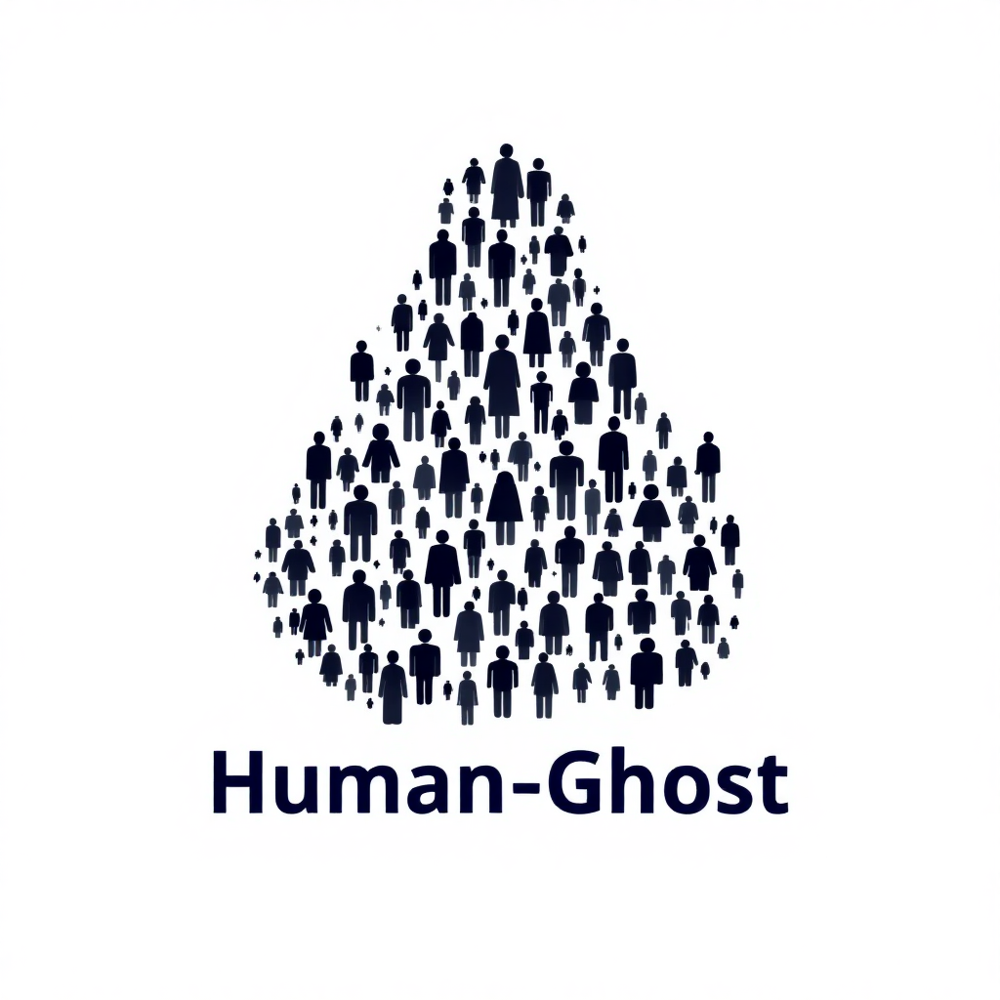

# 🎭 HumanGhost CLI

<p align="center">
  
  
  
</p>

<p align="center">
  <b>Social Engineering Toolkit pour Kali Linux</b><br>
  <sub>🔐 Phishing | 📱 Vishing | 📲 Smishing | 🔓 Tests d'intrusion</sub>
</p>

---

## 📋 Description

**HumanGhost** est un outil en ligne de commande conçu pour **automatiser et orchestrer des attaques de social engineering**, dans un cadre légal et éthique (Red Team, campagnes de tests autorisées).

> ⚠️ **Avertissement** : Cet outil est destiné exclusivement à des fins légitimes telles que les tests de pénétration, la formation à la sensibilisation à la sécurité et l'évaluation des vulnérabilités. Toute utilisation non autorisée est illégale et contraire à l'éthique.

### 🔍 Fonctionnalités principales

- 📧 **Génération automatisée** de scénarios d'ingénierie sociale
- 🌐 **Création rapide** de faux sites de phishing
- 📨 **Automatisation** des campagnes d'emails malveillants
- 📱 **Support** pour SMS (smishing) et appels (vishing)
- 🧩 **Personnalisation** des payloads (liens, pièces jointes, etc.)
- 📜 **Scénarios YAML** pour orchestrer des attaques complexes
- 📊 **Statistiques** sur l'efficacité des campagnes (bientôt)

## ⚙️ Installation

```bash
# Cloner le dépôt
git clone https://github.com/servais1983/HumanGhost.git
cd HumanGhost

# Rendre le script d'installation exécutable
chmod +x install.sh

# Lancer l'installation
./install.sh
```

L'installation met en place les dépendances nécessaires et prépare l'environnement d'exécution sur Kali Linux.

## 🛠️ Commandes

| Commande | Description | Exemple |
|----------|-------------|---------|
| `create` | Génère un scénario de phishing | `python3 humanghost.py create` |
| `host` | Lance un faux site sur localhost | `python3 humanghost.py host` |
| `send` | Envoie les emails ou SMS de phishing | `python3 humanghost.py send` |
| `run` | Exécute un scénario YAML complet | `python3 humanghost.py run scripts/phishing_exec.yaml` |

## 🚀 Exemple d'utilisation

### Exécution d'un scénario prédéfini

```bash
python3 humanghost.py run scripts/phishing_exec.yaml
```

Cette commande va :
1. Créer un scénario de phishing bancaire
2. Héberger un faux site de connexion
3. Envoyer un email de phishing à la cible spécifiée

### Création d'un scénario personnalisé

Vous pouvez créer vos propres scénarios YAML comme celui-ci :

```yaml
name: Campagne de phishing personnalisée
steps:
  - create
  - host
  - send
```

## 🗂️ Structure du projet

```
humanghost/
├── core/              # Modules principaux
│   ├── create.py      # Génération de scénarios
│   ├── send.py        # Envoi des attaques
│   ├── host.py        # Hébergement de sites
│   └── utils.py       # Utilitaires
├── templates/         # Templates HTML
│   ├── fake_login.html # Page de connexion frauduleuse
├── scripts/           # Scénarios prédéfinis
│   └── phishing_exec.yaml
├── humanghost.py      # Point d'entrée principal
├── requirements.txt   # Dépendances Python
├── install.sh         # Script d'installation
└── README.md          # Documentation
```

## 📈 Fonctionnalités à venir

- [ ] Tableau de bord pour suivre le succès des campagnes
- [ ] Génération de QR codes malveillants
- [ ] Intégration avec ChatGPT pour la génération de contenu
- [ ] Templates additionnels (banques, services en ligne, etc.)
- [ ] Options de personnalisation avancées

## 🔒 Sécurité et Éthique

Ce projet est conçu pour des **tests de sécurité légitimes** et pour **sensibiliser à la sécurité**. Utilisez-le uniquement avec une autorisation explicite dans le cadre de :

- ✅ Tests de pénétration autorisés
- ✅ Formations de sensibilisation
- ✅ Évaluations de sécurité internes
- ✅ Démonstrations éducatives

## 🤝 Contribuer

Les contributions sont les bienvenues ! N'hésitez pas à ouvrir une issue ou à soumettre une pull request pour améliorer l'outil.

## 📄 Licence

Ce projet est sous licence MIT. Voir le fichier LICENSE pour plus de détails.

---

<p align="center">
  <sub>🔐 Développé pour promouvoir la sensibilisation à la sécurité et les tests d'intrusion éthiques 🛡️</sub>
</p>
